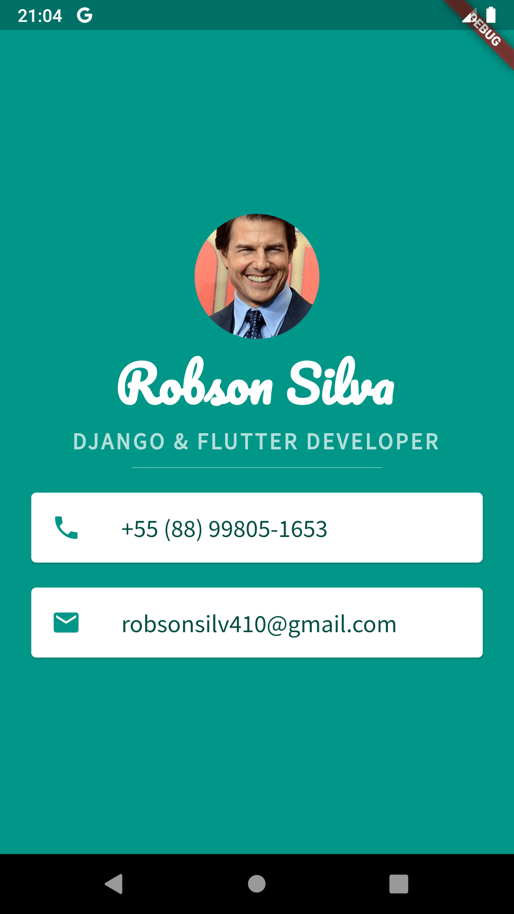

## Mi Card (Flutter)

Aplicação para apresentação profissional desenvolvida com [Flutter](https://flutter.dev/) para estudos.

## Imagens

*Apesar de parecer comigo, a foto do perfil é do Tom Cruise :satisfied:.

## Feito com

- [Dart](https://dart.dev/)
- [Flutter](https://flutter.dev/)
- [Material Design](https://material.io/)
- [Visual Studio Code](https://code.visualstudio.com/)

## Autor

- **Robson Silva** - _Trabalho inicial_ - [robsonsilv4](https://github.com/robsonsilv4)
